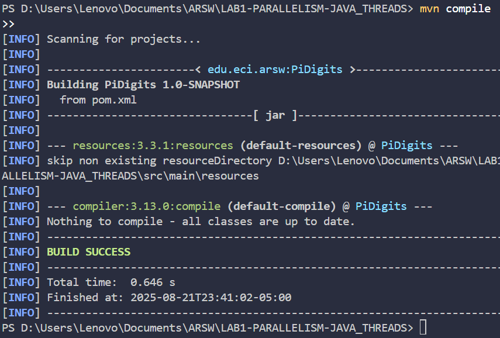
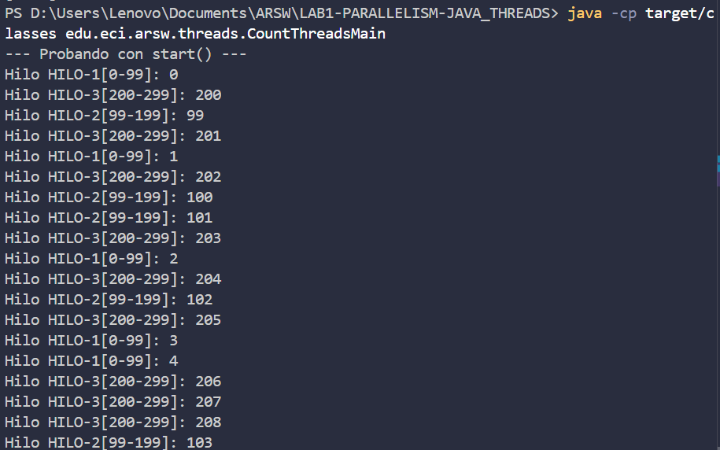
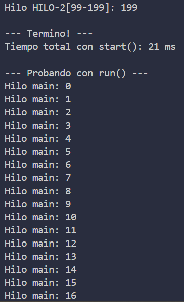
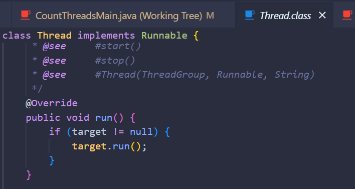
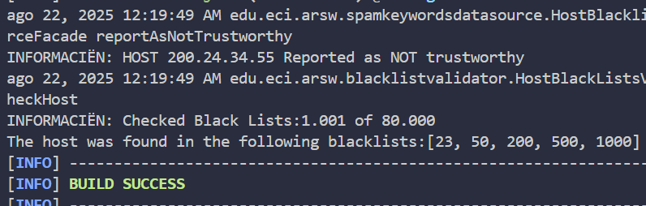
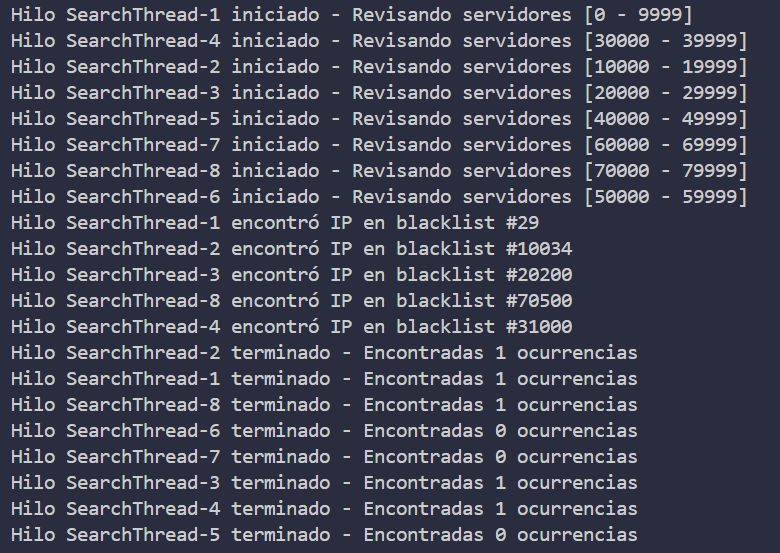

# 🧵 Multithreading Laboratory - Blacklist Validator

## 👥 **Team Members**
- [Jesús Alfonso Pinzón Vega](https://github.com/JAPV-X2612)
- [David Felipe Velásquez Contreras](https://github.com/DavidVCAI)
---

## 🚀 **Laboratory 1 Development**

### 📋 **Prerequisites & Setup**

**Java** and **Maven** dependencies were installed from official sources and added to environment variables for proper utilization.

#### 🔧 **Maven Configuration**

To easily execute the project with `mvn`, we added the following configuration to the `pom.xml`:

```xml
<build>
    <plugins>
        <plugin>
            <groupId>org.codehaus.mojo</groupId>
            <artifactId>exec-maven-plugin</artifactId>
            <version>3.1.0</version>
            <configuration>
                <mainClass>edu.eci.arsw.blacklistvalidator.Main</mainClass>
            </configuration>
        </plugin>
    </plugins>
</build>
```

#### ⚡ **Quick Execution Command**

Use the following command to clean, compile, and execute the Main class:

```bash
mvn clean compile exec:java
```

---

## 🎯 **Part 1: Thread Implementation & Testing**

### 📝 **Objective**
Implement thread classes and analyze the differences between execution methods.

### 🔨 **Implementation Details**

We developed the **CountThread** class that extends `Thread`, which:
  - Displays specific thread execution in console
  - Defines threads within an inclusive range
  - Provides execution insights through logging

#### 🧪 **Testing Methodology**

The main class creates threads and tests differences between:
  - **`start()`** method execution
  - **`run()`** method execution

Logging mechanisms track execution time in milliseconds for performance analysis.

### 🏗️ **Build Process**

First, compile the project:

```bash
mvn compile
```



### ▶️ **Execution Examples**

Execute directly with **Java**:

```bash
java -cp target/classes edu.eci.arsw.threads.CountThreadsMain
```

#### 🔄 **Concurrent Execution with `start()`**



*Result*: Threads execute **concurrently** when using `start()`.

#### 📋 **Sequential Execution with `run()`**



*Result*: Threads execute **sequentially** in the main thread when using `run()`.

### 🧠 **Key Insights & Analysis**

#### **`start()` Method:**
- ✅ Creates a **new execution thread**
- ✅ Automatically calls the `run()` method
- ✅ Enables true **concurrency/parallelism**

#### **`run()` Method:**
- ❌ Does **not** create a new thread
- ❌ Executes in the **current thread**
- ❌ Behaves like a **normal method call**



#### 🔗 **Thread Synchronization**

**`Thread.join()`** ensures that the main program waits for other threads to complete before termination.

> **Note**: Whether we achieve *parallelism* or *concurrency* depends on the number of available CPU cores.

---

## 🛡️ **Part 2: Blacklist Validation Parallelization**

### 📊 **Initial Analysis**

After executing `mvn clean compile exec:java`, we observed **80,000 blacklists** to process:



### 🎯 **Parallelization Strategy**

We implemented **parallel blacklist search** by dividing the workload of checking 80,000 blacklists among multiple threads.

#### 🏗️ **Implementation Architecture**

##### 1️⃣ **BlackListSearchThread Class**
- **Extends**: `Thread`
- **Function**: Searches specific blacklist segments
- **Scope**: Individual thread workload management

##### 2️⃣ **HostBlackListsValidator Modification**
- **New Method**: `checkHost(String ipaddress, int N)`
- **Implementation**: Parallel search algorithm

#### ⚙️ **Algorithm Details**

```java
// Segment calculation
int segmentSize = totalServers / N;
int remainder = totalServers % N;

// Distribute remaining servers among first threads
```

#### 🔄 **Synchronization Strategy**
- **`thread.join()`**: Wait for all threads to complete
- **Result collection**: Gather results after thread completion
- **Logging**: Maintain original LOG showing reviewed vs total lists

### 🧪 **Performance Testing**

Execute the parallel implementation:

```bash
java -cp target/classes edu.eci.arsw.blacklistvalidator.ParallelMain
```

#### 📈 **Test Results**

##### **Test 1** - *Less Dispersed IP* (`200.24.34.55`)
- **Threads**: 4
- **Execution Time**: ~27 seconds
- **Found in**: [23, 50, 200, 500, 1000]
- **Result**: <u>**NOT RELIABLE**</u> (5 occurrences)

##### **Test 2** - *More Dispersed IP* (`202.24.34.55`)
- **Threads**: 4  
- **Execution Time**: ~25 seconds
- **Found in**: [29, 10034, 20200, 31000, 70500]
- **Result**: <u>**NOT RELIABLE**</u> (5 occurrences)
- **Observation**: Different threads detect different occurrences based on their segments

##### **Test 3** - *Clean IP* (`212.24.24.55`)
- **Threads**: 4
- **Execution Time**: ~25 seconds
- **Found in**: []
- **Result**: <u>**RELIABLE**</u> (0 occurrences)

### 📊 **Performance Scaling Analysis**

Using the worst-case scenario (*most dispersed IP*: `202.24.34.55`):

| **Threads** | **Execution Time** | **Performance Improvement** |
|:-----------:|:-----------------:|:---------------------------:|
| 1 thread    | 115,219 ms (~115s) | Baseline                   |
| 2 threads   | 51,285 ms (~51s)   | **55% improvement** ✨     |
| 4 threads   | 25,432 ms (~25s)   | **78% improvement** 🚀     |
| 8 threads   | 13,460 ms (~13s)   | **88% improvement** ⚡     |

#### 🖥️ **8-Thread Execution Logs**



---

## 📋 **Conclusions & Analysis**

### ✅ **Key Achievements**

1. **Parallelization Success**: Achieved significant execution time reduction
2. **Scalability**: Doubling threads approximately halves execution time
3. **Synchronization**: Results properly aggregated at completion
4. **Embarrassingly Parallel Problem**: No dependencies between segments allow independent thread operation

### 🎯 **Performance Insights**

- **Linear Scaling**: Performance improvement scales linearly with thread count
- **CPU Utilization**: Effectively leverages multiple processor cores
- **Workload Distribution**: Each thread efficiently processes its assigned segment

### 🔍 **2.1 Future Improvements**

**Current Challenge**: Execution time remains relatively constant regardless of use case, indicating all servers are being checked regardless of early findings.

**Proposed Solution**: Implement an **early termination mechanism** where:
  - Threads can signal completion to other threads
  - **Faster execution** for less dispersed cases
  - **Optimized resource utilization**

---

## 🔗 **Additional Resources**

- [Maven Exec Plugin Documentation](https://www.mojohaus.org/exec-maven-plugin/)
- [Java Threading Tutorial](https://docs.oracle.com/javase/tutorial/essential/concurrency/)
- [Parallel Computing Concepts](https://en.wikipedia.org/wiki/Parallel_computing)
