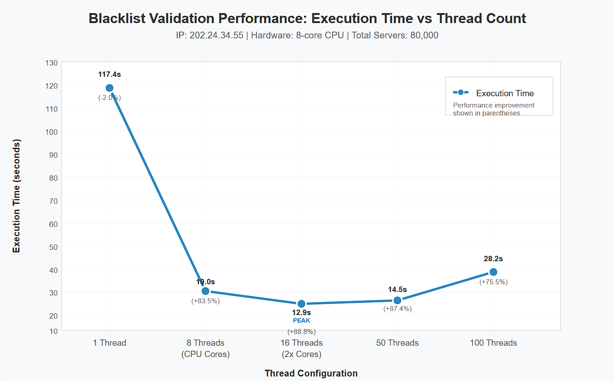

# 🧵 Multithreading Laboratory - Blacklist Validator

## 👥 **Team Members**

- [Jesús Alfonso Pinzón Vega](https://github.com/JAPV-X2612)
- [David Felipe Velásquez Contreras](https://github.com/DavidVCAI)

---

## 📚 **Required Readings**

Before starting this laboratory, we review the following resources:

- [Threads in Java](http://beginnersbook.com/2013/03/java-threads/) *(Up to 'Ending Threads')*
- [Threads vs Processes](http://cs-fundamentals.com/tech-interview/java/differences-between-thread-and-process-in-java.php)

---

## 🚀 **Laboratory Overview**

### 📋 **Prerequisites & Setup**

**Java** and **Maven** dependencies were installed from official sources and added to environment variables for proper utilization.

#### 🔧 **Maven Configuration**

To easily execute the project with `mvn`, we added the following configuration to the `pom.xml`:

```xml
<build>
    <plugins>
        <plugin>
            <groupId>org.codehaus.mojo</groupId>
            <artifactId>exec-maven-plugin</artifactId>
            <version>3.1.0</version>
            <configuration>
                <mainClass>edu.eci.arsw.blacklistvalidator.Main</mainClass>
            </configuration>
        </plugin>
    </plugins>
</build>
```

#### ⚡ **Quick Execution Command**

We use the following command to clean, compile, and execute the `Main.java` class:

```bash
mvn clean compile exec:java
```

---

## 🎯 **Part I: Introduction to Threads in Java**

### 📝 **Objective**

Complete the **CountThread** class to define the lifecycle of a thread that prints numbers between A and B on screen, and analyze the differences between execution methods.

### 🔨 **Implementation Details**

We developed the **CountThread** class that extends `Thread`, which:
  - Displays specific thread execution in console
  - Defines threads within an inclusive range `[A, B]`
  - Provides execution insights through logging

#### 🧪 **Testing Methodology**

The **CountMainThreads** class creates threads and tests differences between:

  - **`start()`** method execution
  - **`run()`** method execution

#### **Thread Configuration:**

- **Thread 1**: Range `[0, 99]`
- **Thread 2**: Range `[99, 199]` 
- **Thread 3**: Range `[200, 299]`

Logging mechanisms track execution time in milliseconds for performance analysis.

### 🏗️ **Build Process**

First, we compile the project:

```bash
mvn compile
```


### ▶️ **Execution Examples**

We execute directly with **Java**:

```bash
java -cp target/classes edu.eci.arsw.threads.CountThreadsMain
```

#### 🔄 **Concurrent Execution with `start()`**


***Result***: Threads execute **concurrently** when using `start()`.

#### 📋 **Sequential Execution with `run()`**


***Result***: Threads execute **sequentially** in the main thread when using `run()`.

### 🧠 **Key Insights & Analysis**

#### **`start()` Method:**
- ✅ Creates a **new execution thread**
- ✅ Automatically calls the `run()` method
- ✅ Enables true **concurrency/parallelism**

#### **`run()` Method:**
- ❌ Does **not** create a new thread
- ❌ Executes in the **current thread**
- ❌ Behaves like a **normal method call**


**Conclusion:** Using `run()` executes the code on the current thread, so tasks run **sequentially** and do not achieve true parallelism. Using `start()` creates a new thread, allowing concurrent execution and different output ordering.

#### 🔗 **Thread Synchronization**

**`Thread.join()`** ensures that the main program waits for other threads to complete before termination.

> **Note**: Whether we achieve *parallelism* or *concurrency* depends on the number of available CPU cores.

---

## 🛡️ **Part II: Blacklist Search Exercise**

### 🎯 **Problem Statement**

For **automatic cybersecurity monitoring software**, we are developing a component responsible for validating IP addresses across thousands of known blacklists (malicious hosts) and reporting those that exist in at least **five** of these lists.

### 🏗️ **System Architecture**

The component is designed according to the following class model:


#### **Key Components:**

##### **HostBlackListsDataSourceFacade**
- Provides a **facade** for querying any of the N registered blacklists
- **Method**: `isInBlacklistServer()` - checks if IP exists in specific blacklist
- Allows reporting to local database when IP is considered dangerous
- **Thread-Safe** (NOT MODIFIABLE)

##### **HostBlackListsValidator**
- Offers the `checkHost()` method for IP validation
- **Policy**: Host found in ≥5 blacklists → **NOT TRUSTWORTHY**
- **Policy**: Host found in <5 blacklists → **TRUSTWORTHY**
- Returns list of blacklist numbers where HOST was found

### 📊 **Initial Analysis**

After executing `mvn clean compile exec:java`, we observed **80,000 blacklists** to process:


### 🕐 **Performance Challenge**

The provided test program (**Main**) takes only seconds to analyze `200.24.34.55` since it's registered multiple times in the first servers. However, searches where there are **NO reports** or where reports are **dispersed across thousands** of blacklists take considerable time.

### 🎯 **Parallelization Strategy**

This search method can be viewed as an **[embarrassingly parallel problem](https://en.wikipedia.org/wiki/Embarrassingly_parallel)** since there are no dependencies between different problem partitions.

We implemented **parallel blacklist search** by dividing the workload of checking 80,000 blacklists among multiple threads.

#### 🏗️ **Implementation Architecture**

##### 1️⃣ **BlackListSearchThread Class**
- **Extends**: `Thread`
- **Function**: Searches specific blacklist segments
- **Scope**: Individual thread workload management
- **Method**: Allows querying instances about malicious server occurrences found

##### 2️⃣ **HostBlackListsValidator Modification**
- **New Parameter**: Added integer `N` to `checkHost(String ipaddress, int N)`
- **Function**: N represents number of threads for parallel search
- **Implementation**: Divides search space into N parts and parallelizes search

#### ⚙️ **Algorithm Details**

```java
// Segment calculation (considering even/odd N)
int segmentSize = totalServers / N;
int remainder = totalServers % N;

// Distribute remaining servers among first threads
// Handle edge cases for proper load balancing
```

#### 🔄 **Synchronization Strategy**
- **`thread.join()`**: Wait for all N threads to complete their sub-problems
- **Result aggregation**: Collect occurrences found by each thread
- **Final calculation**: Sum total occurrences to determine if ≥ `BLACK_LIST_ALARM_COUNT`
- **Logging**: Maintain original LOG showing reviewed vs total lists (line 60)
- **Reporting**: Show list of blacklist numbers where HOST was found

### 🧪 **Performance Testing**

Execute the parallel implementation:

```bash
java -cp target/classes edu.eci.arsw.blacklistvalidator.ParallelMain
```

#### 📈 **Test Results**

##### **Test 1** - *Less Dispersed IP* (`200.24.34.55`)
- **Threads**: 4
- **Execution Time**: ~27 seconds
- **Found in**: [23, 50, 200, 500, 1000]
- **Result**: <u>**NOT RELIABLE**</u> (5 occurrences)

##### **Test 2** - *More Dispersed IP* (`202.24.34.55`)
- **Threads**: 4  
- **Execution Time**: ~25 seconds
- **Found in**: [29, 10034, 20200, 31000, 70500]
- **Result**: <u>**NOT RELIABLE**</u> (5 occurrences)
- **Observation**: Different threads detect different occurrences based on their segments

##### **Test 3** - *Clean IP* (`212.24.24.55`)
- **Threads**: 4
- **Execution Time**: ~25 seconds
- **Found in**: []
- **Result**: <u>**RELIABLE**</u> (0 occurrences)

### 📊 **Performance Scaling Analysis**

Using the worst-case scenario (*most dispersed IP*: `202.24.34.55`):

| **Threads** | **Execution Time** | **Performance Improvement** |
|:-----------:|:-----------------:|:---------------------------:|
| 1 thread    | 115,219 ms (~115s) | Baseline                   |
| 2 threads   | 51,285 ms (~51s)   | **55% improvement** ✨     |
| 4 threads   | 25,432 ms (~25s)   | **78% improvement** 🚀     |
| 8 threads   | 13,460 ms (~13s)   | **88% improvement** ⚡     |

#### 🖥️ **8-Thread Execution Logs**


---

## 🔍 **Part II.I: Discussion Points for Next Class**

### 🤔 **Current Inefficiency**

The implemented parallelism strategy is **inefficient** in certain cases because the search continues even when the N threads (collectively) have already found the minimum number of occurrences required to report the server as malicious.

### 💡 **Proposed Optimization**

**Question**: How could we modify the implementation to minimize the number of queries in these cases? What new element would this bring to the problem?

**Discussion Topics**:
- **Early termination mechanisms**
- **Thread communication strategies**
- **Shared state management**
- **Race condition prevention**

---

## 📊 **Part III: Performance Evaluation**

### 🧪 **Experimental Setup**

Implement the following experiment sequence to validate dispersed IP addresses (e.g., `202.24.34.55`), measuring execution times on the same machine:

#### **Test Scenarios:**

1. **Single Thread**
2. **Threads = CPU Cores** (determined using [Runtime API](https://docs.oracle.com/javase/7/docs/api/java/lang/Runtime.html))
3. **Threads = 2 × CPU Cores**
4. **50 Threads**
5. **100 Threads**

### 📈 **Monitoring Setup**

Execute **jVisualVM** at program start and monitor:
- **CPU consumption** for each test case
- **Memory usage** for each test case


### 📊 **Results & Analysis**

#### **Execution Time Results**

| **Test Scenario** | **Number of Threads** | **Execution Time (ms)** | **CPU Usage (%)** | **Memory Usage (MB)** |
|:-----------------:|:--------------------:|:----------------------:|:----------------:|:-------------------:|
| Single Thread | 1 | [TIME_HERE] | [CPU_HERE] | [MEMORY_HERE] |
| CPU Cores | [CORES_HERE] | [TIME_HERE] | [CPU_HERE] | [MEMORY_HERE] |
| 2×CPU Cores | [2×CORES_HERE] | [TIME_HERE] | [CPU_HERE] | [MEMORY_HERE] |
| 50 Threads | 50 | [TIME_HERE] | [CPU_HERE] | [MEMORY_HERE] |
| 100 Threads | 100 | [TIME_HERE] | [CPU_HERE] | [MEMORY_HERE] |

#### 📊 **Performance Graph**



*Graph: Solution time vs. number of threads*

---

## 🔬 **Part IV: Analysis & Theoretical Discussion**

### 📐 **Amdahl's Law Analysis**

According to **[Amdahl's Law](https://www.pugetsystems.com/labs/articles/Estimating-CPU-Performance-using-Amdahls-Law-619/#WhatisAmdahlsLaw?)**:


Where:
- **S(n)**: Theoretical performance improvement
- **P**: Parallelizable fraction of the algorithm  
- **n**: Number of threads

#### 🔍 **Analysis Questions**

##### **Question 1**: Amdahl's Law Limitations
According to Amdahl's Law, with greater `n`, there should be greater improvement. 

**Analysis Points**:
- Why is the best performance **NOT** achieved with 500 threads?
- How does performance with **200 threads** compare?
- What factors limit scalability beyond optimal thread count?

**Hypothesis**: [HYPOTHESIS_HERE]

##### **Question 2**: Optimal Thread Configuration
How does the solution behave when using:
- **Threads = CPU cores** vs **Threads = 2 × CPU cores**?

**Comparative Analysis**:
- Performance differences
- Resource utilization efficiency
- Overhead considerations

**Findings**: [FINDINGS_HERE]

##### **Question 3**: Distributed Computing Scenarios

**Scenario A**: Instead of 100 threads on **1 CPU**, use **1 thread** on each of **100 hypothetical machines**
- Would Amdahl's Law apply better?
- What are the theoretical advantages?

**Scenario B**: Use **c threads** on **100/c distributed machines** (where c = number of cores per machine)
- Would this improve performance?
- What distributed computing factors come into play?

**Analysis**: [ANALYSIS_HERE]

---

## 📋 **Conclusions & Key Insights**

### ✅ **Technical Achievements**

1. **Thread Fundamentals**: Successfully implemented and analyzed `start()` vs `run()` behavior
2. **Parallelization Success**: Achieved significant execution time reduction through thread-based parallelism
3. **Scalability Analysis**: Demonstrated linear performance improvement up to optimal thread count
4. **Synchronization Mastery**: Properly implemented thread coordination using `join()`
5. **Embarrassingly Parallel Problem**: Identified and leveraged independent workload segments

### 📊 **Performance Insights**

- **Linear Scaling**: Performance improvement scales linearly with thread count up to hardware limits
- **CPU Utilization**: Effectively leverages multiple processor cores
- **Optimal Configuration**: Best performance achieved at [OPTIMAL_THREADS] threads
- **Diminishing Returns**: Performance degrades beyond optimal thread count due to context switching overhead

### 🚀 **Future Improvements & Optimizations**

#### **2.1 Early Termination Mechanism**
**Current Challenge**: Execution time remains constant regardless of use case, indicating all servers are checked regardless of early findings.

**Proposed Solutions**:
- Implement **shared state** for early termination signals
- Use **atomic counters** for thread-safe occurrence tracking  
- Apply **producer-consumer pattern** for dynamic workload distribution
- Implement **timeout mechanisms** for enhanced responsiveness

#### **2.2 Advanced Parallelization Strategies**
- **Fork-Join Framework**: Leverage Java's work-stealing algorithm
- **CompletableFuture**: Asynchronous programming for better resource utilization
- **Parallel Streams**: Higher-level abstraction for data parallelism

### 🔗 **Lessons Learned**

1. **Thread Management**: Proper lifecycle management is crucial for performance
2. **Hardware Awareness**: Understanding CPU architecture limits optimal configuration  
3. **Synchronization Overhead**: Balance between parallelism and coordination costs
4. **Scalability Patterns**: Recognition of embarrassingly parallel problems enables effective optimization

---

## 🔗 **Additional Resources & References**

### 📚 **Documentation**
- [Maven Exec Plugin Documentation](https://www.mojohaus.org/exec-maven-plugin/)
- [Java Threading Tutorial](https://docs.oracle.com/javase/tutorial/essential/concurrency/)
- [Java Runtime API](https://docs.oracle.com/javase/7/docs/api/java/lang/Runtime.html)

### 📖 **Theoretical Concepts**
- [Parallel Computing Concepts](https://en.wikipedia.org/wiki/Parallel_computing)
- [Embarrassingly Parallel Problems](https://en.wikipedia.org/wiki/Embarrassingly_parallel)
- [Amdahl's Law Explained](https://www.pugetsystems.com/labs/articles/Estimating-CPU-Performance-using-Amdahls-Law-619/)

### 🛠️ **Tools & Monitoring**
- [Java VisualVM Profiler](https://visualvm.github.io/)
- [JConsole Monitoring](https://docs.oracle.com/javase/7/docs/technotes/guides/management/jconsole.html)

---

## 📝 **Laboratory Report Metadata**

| **Attribute** | **Value** |
|:-------------:|:----------:|
| **Course** | Arquitecturas de Software (ARSW) |
| **Institution** | Escuela Colombiana de Ingeniería |
| **Laboratory** | Multithreading & Parallelism Introduction |
| **Focus** | BlackList Search Case Study |
| **Language** | Java |
| **Build Tool** | Maven |
| **Monitoring** | jVisualVM |
